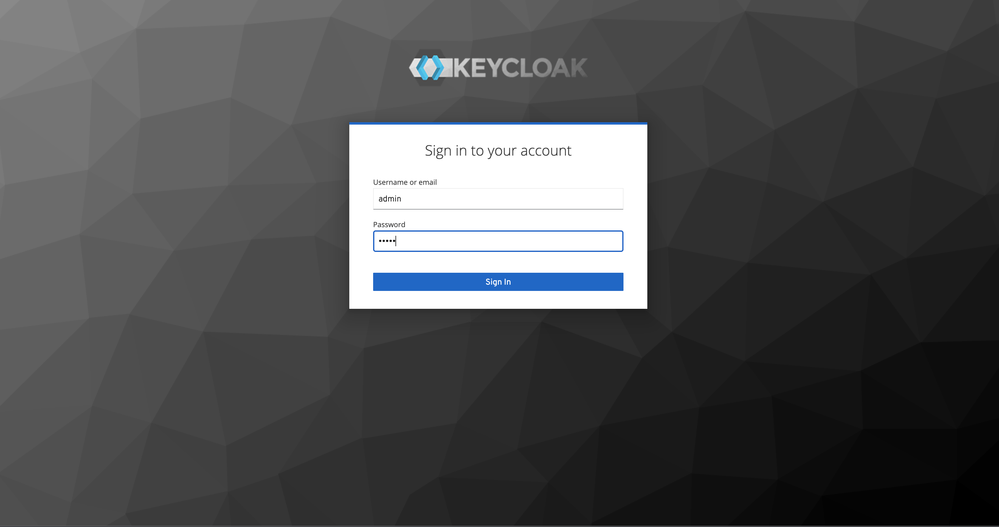
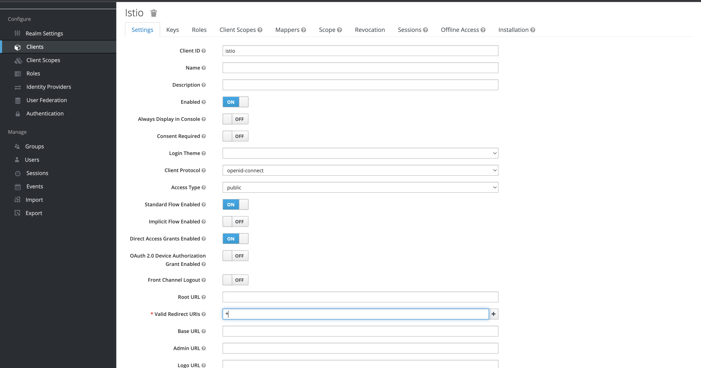
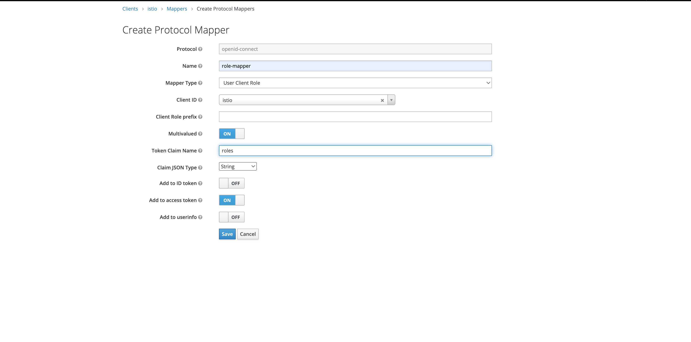
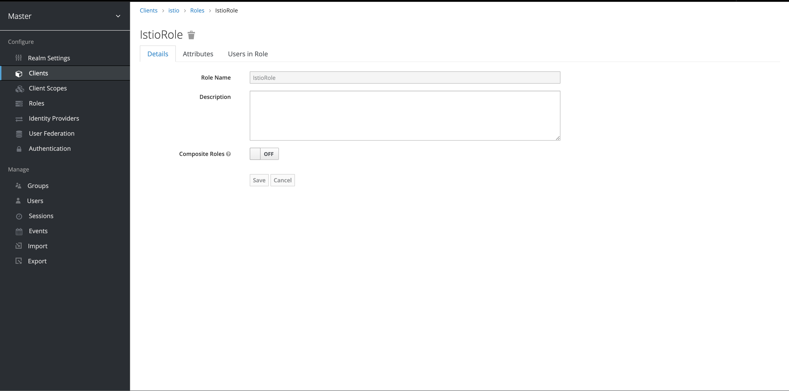
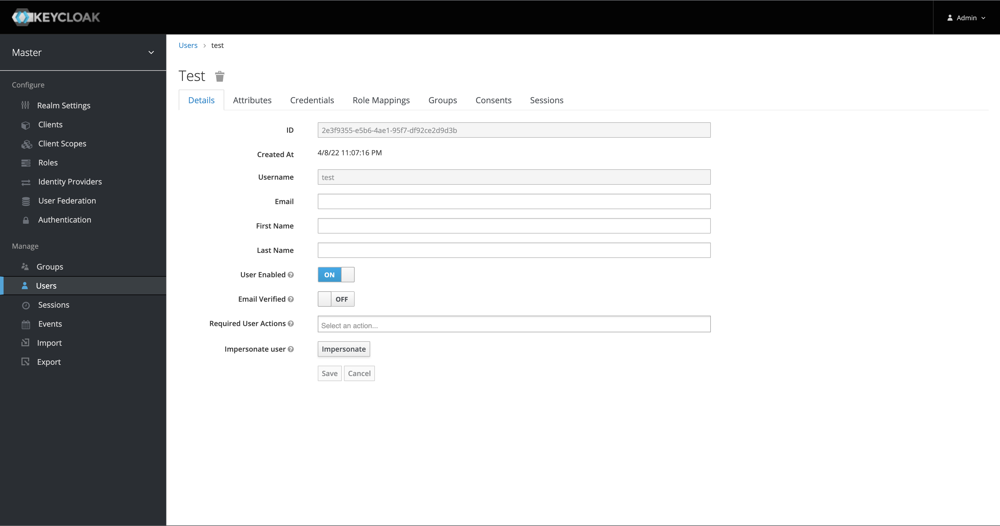
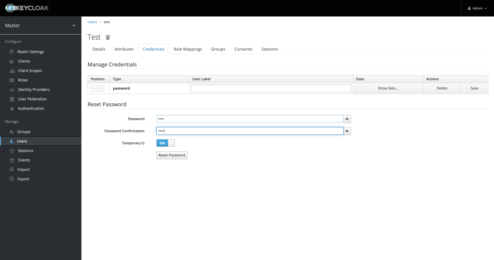
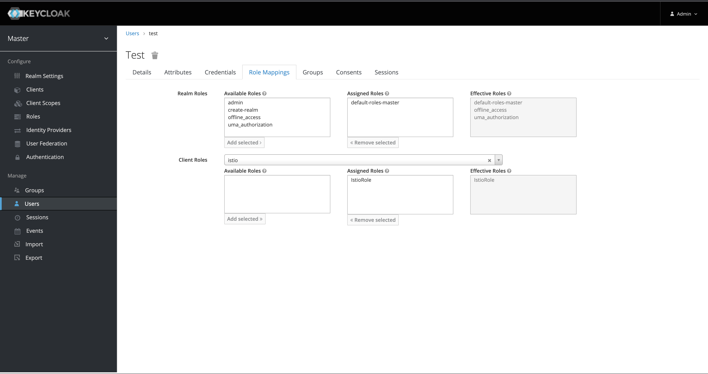
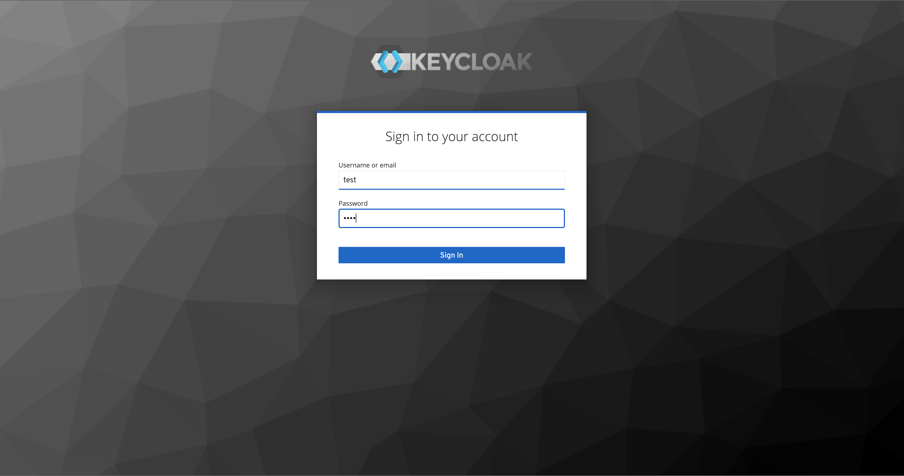
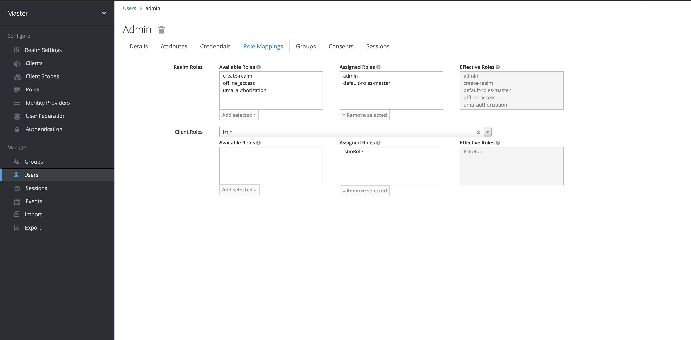

# Istio-Keycloak-k8s-spring-boot/

This is sample repo to shows how to route requests based on JWT claims with authentication and authorizations on an Istio ingress gateway using Keycloak 

## POC:
<li>
Deploy Keycloak and configure service account client
</li>
<li>
Secure Istio Ingress gateway Keycloak's JWT
</li>

## Prerequisite

<li>
Kubernetes Cluster (tested on v1.21.5)
 </li>
 <li>
Istio Instalation (tested on istio-1.13.2)
</li>
<li>
Kiali Dashboard
</li>

# Istio sur le cluser k8s

> istioctl install --set profile=demo -y
>
> kubectl label namespace defaul istio-injection=enabled

## If the EXTERNAL-IP value is set, your environment has an external load balancer that you can use for the ingress gateway. If the EXTERNAL-IP value is <none> (or perpetually <pending>), your environment does not provide an external load balancer for the ingress gateway. In this case, you can access the gateway using the service’s :
 
 > istioctl install --set profile=default --set values.gateways.istio-ingressgateway.type=NodePort -y
 
 ## Ensure that there are no issues with the configuration:

 > istioctl analyze

# Deploy Keycloak

> docker-compose up

# Configure Keycloak

## Client

### 1 - Login : admin/admin

### 2 - Create client

### 3 - Create client mapper

### 4 - Create client role

## User

### 1 - Create user

### 2 - User password : test

### 3 - User role mapper

### 3 - Login with user test

## add role istio role to admin user

# Start app

> cd k8s

> kubectl create -f deployment.yaml

> kubectl create -f gateway.yaml

> kubectl create -f istio-auth.yaml

> kubectl port-forward -n istio-system svc/istio-ingressgateway 8082:80

> Note - you can access the swagger GUI at http://localhost:8082/app/swagger-ui.html

# Get access token pour user test pouvant effecuer un POST

> export TKN=$(curl -d 'username=test' -d 'password=test' -d 'grant_type=password' -d 'client_id=istio' http://localhost:8180/auth/realms/master/protocol/openid-connect/token | jq -r '.access_token')

# Get access token pour user admin ne pouvant pas effecuer un POST

> export TKN=$(curl -d 'username=admin' -d 'password=admin' -d 'grant_type=password' -d 'client_id=istio' http://localhost:8180/auth/realms/master/protocol/openid-connect/token | jq -r '.access_token')

# Kiali

> cd istio-1.13.2
> 
> kubectl create -f samples/addons/prometheus.yaml
>
> kubectl create -f samples/addons/kiali.yaml
>
> istioctl dashboard kiali
